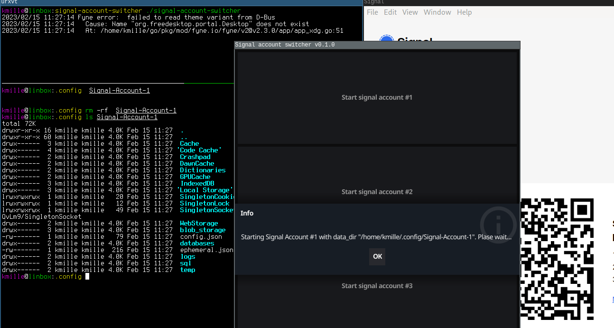

# signal-account-switcher
A simple tool that allows you to run multiple instances of signal-desktop (four additional accounts) on your Laptop. There are ready-to-use binaries for all major platforms (Linux, Mac, Windows). Start the `signal-account-switcher`. When you click on 'Start signal account #1'
1) a `data_dir` is created in `$working_dir/Signal-Account-1`
2) `signal-desktop` is executed with the parameter `--user-data-dir=$working_dir/Signal-Account-1`

Depending on your OS, $working_dir is `~/.config`, `$HOME/Library/Application` or `%AppData%`. If you want to remove all data from an account, just delete the directory in $working_dir.

# Screenshot



# How to build it 
For Linux, just use:
```bash
kmille@linbox:signal-account-switcher go build -o signal-account-switcher ./main.go
kmille@linbox:signal-account-switcher strip signal-account-switcher
kmille@linbox:signal-account-switcher file signal-account-switcher
signal-account-switcher: ELF 64-bit LSB executable, x86-64, version 1 (SYSV), dynamically linked, interpreter /lib64/ld-linux-x86-64.so.2, BuildID[sha1]=c60867bc53ad2ff8f56622bf24c85842f2cec213, for GNU/Linux 4.4.0, stripped
```

To cross-compile it for Windows and Mac, use `fyne-cross` (needs Docker)

```bash
go install github.com/fyne-io/fyne-cross@latest
ls $GOPATH/bin/fyne-cross
```
Cross-compilation for Windows:  
```bash
kmille@linbox:signal-account-switcher sudo $GOPATH/bin/fyne-cross windows -name signal-account-switcher.exe
[i] Target: windows/amd64
[i] Cleaning target directories...
[✓] "bin" dir cleaned: /home/kmille/projects/signal-account-switcher/fyne-cross/bin/windows-amd64
[✓] "dist" dir cleaned: /home/kmille/projects/signal-account-switcher/fyne-cross/dist/windows-amd64
[✓] "temp" dir cleaned: /home/kmille/projects/signal-account-switcher/fyne-cross/tmp/windows-amd64
[i] Checking for go.mod: /home/kmille/projects/signal-account-switcher/go.mod
[✓] go.mod found
[i] Building binary...
[✓] Binary: /home/kmille/projects/signal-account-switcher/fyne-cross/bin/windows-amd64/signal-account-switcher.exe
[i] Packaging app...
[✓] Package: /home/kmille/projects/signal-account-switcher/fyne-cross/dist/windows-amd64/signal-account-switcher.exe.zip
kmille@linbox:signal-account-switcher file /home/kmille/projects/signal-account-switcher/fyne-cross/bin/windows-amd64/signal-account-switcher.exe
/home/kmille/projects/signal-account-switcher/fyne-cross/bin/windows-amd64/signal-account-switcher.exe: PE32+ executable (GUI) x86-64 (stripped to external PDB), for MS Windows, 12 sections
kmille@linbox:signal-account-switcher
```
Cross-compilation for Mac:  
Hmpf, the [docs](https://github.com/fyne-io/fyne-cross#build-the-docker-image-for-osxdarwinapple-cross-compiling) say you need the "Command Line Tools for Xcode". I can't get them without an account...

# Build Cleanup
```bash
sudo docker rmi fyneio/fyne-cross:1.3-windows
sudo docker rmi fyneio/fyne-cross:1.3-base-llvm
```

